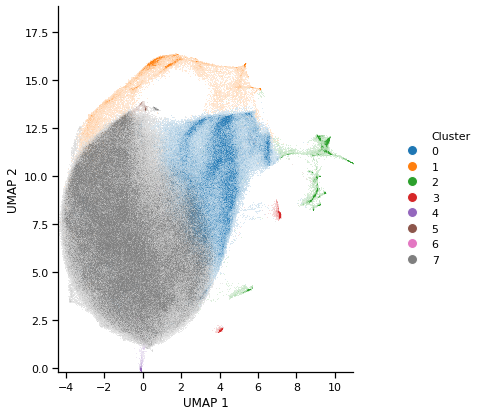

# Single cell plotting functions 
Library of plotting functions specific to single cell flow cytometry data. Use same basic syntax as seaborn figure level plots

To use this package:
1. Download and unzip package into an easily accessible (not Downloads) folder in your computer
2. Add path to this folder to your script, and import relevant plotting functions from the library

Examples:
1D Biexponential X:  

2D Biexponential X and Y, Biexponential Hue, Column, Column wrapping:  

2D Biexponential X and Y, Categorical Hue, Show lower densities:  

2D Linear X and Y, Categorical Hue, Column:  

2D Biexponential X and Y, Biexponential Hue, Row, Column:  

