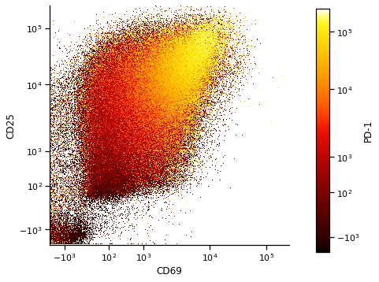

# Single cell plotting functions 
Library of plotting functions specific to single cell flow cytometry data. Use same basic syntax as seaborn figure level plots

To use this package:
1. Download and unzip package into an easily accessible (not Downloads) folder in your computer
2. Add path to this folder to your script, and import relevant plotting functions from the library

**Examples**:  
  
1D Biexponential X: 
``` 
g = facetedSingleCellKDE(data=plottingDf,x='CD69',hue='Cluster',scaleToMode=True,smooth_res=80)   
``` 


2D Biexponential X and Y, Biexponential Hue, Different Colormaps:  
``` 
g = facetedSingleCellScatter(data=plottingDf,x='CD69',y='CD25',hue='PD-1',
    biExpXYScale=True,biExpHueScale=True,palette='RdBu_r')   

g = facetedSingleCellScatter(data=plottingDf,x='CD69',y='CD25',hue='PD-1',
    biExpXYScale=True,biExpHueScale=True,palette=cc.cm.fire)  
```
  


2D Linear X and Y, Categorical Hue:  
``` 
g = facetedSingleCellScatter(data=plottingDf,x='UMAP 1',y='UMAP 2',hue='Cluster',
    palette=cc.glasbey,hue_order=sortedClusterLabels)  
``` 


2D Biexponential X and Y, Categorical Hue, Show lower densities:  
``` 
g = facetedSingleCellScatter(data=clusteredDf.reset_index(),x='CD69',y='CD25',hue='Cluster',biExpXYScale=True,
    col='Cluster',col_wrap=4,col_order=sortedClusterLabels,hue_order=sortedClusterLabels,spread_threshold=0.5)  
``` 


2D Biexponential X and Y, Biexponential Hue, Column, Column wrapping:  
``` 
g = facetedSingleCellScatter(data=plottingDf,x='CD69',y='CD25',hue='PD-1',biExpXYScale=True,
    biExpHueScale=True,palette='RdBu_r',col='Cluster',col_wrap=4,col_order=sortedClusterLabels)  
``` 


2D Biexponential X and Y, Biexponential Hue, Row, Column:  
``` 
g = facetedSingleCellScatter(data=plottingDf,x='CD4',y='CD8',hue='CD25',col='EffectorTargetRatio',
    row='Time',palette='RdBu_r',biExpXYScale=True,biExpHueScale=True,col_order=['0.2','0.5','1','2'],dpi=200)  
``` 

